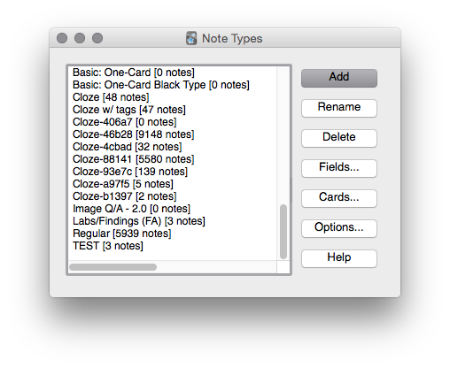
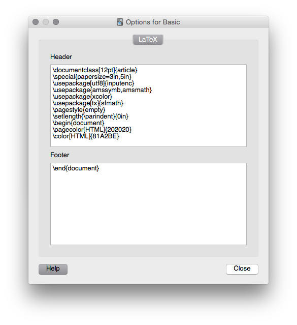
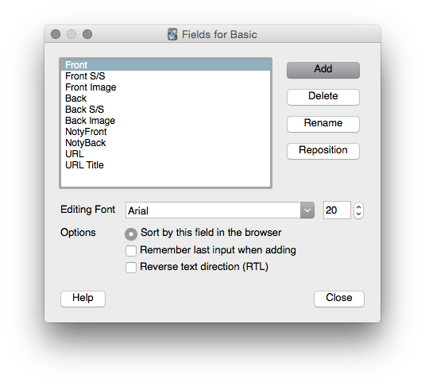
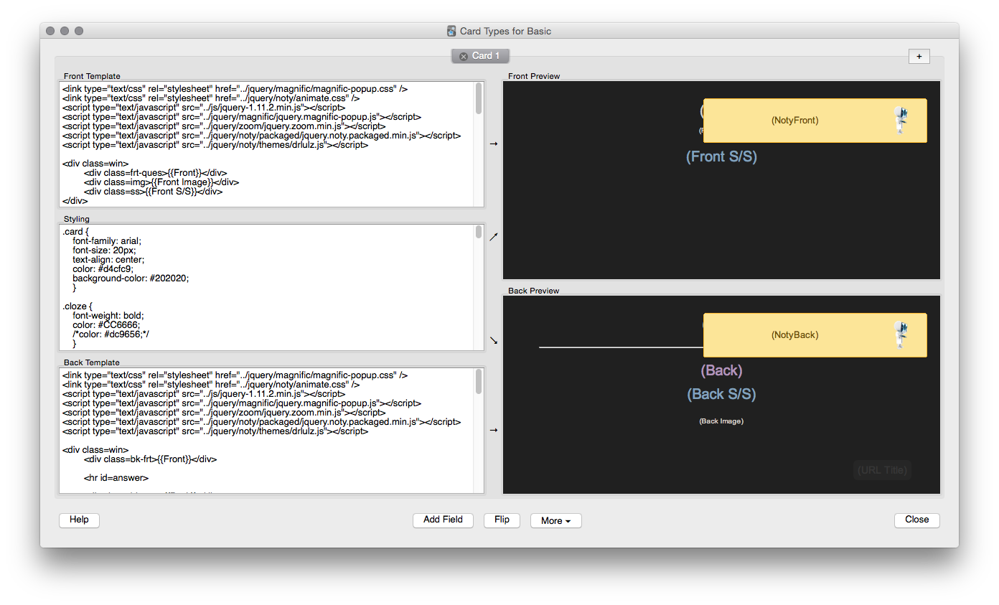
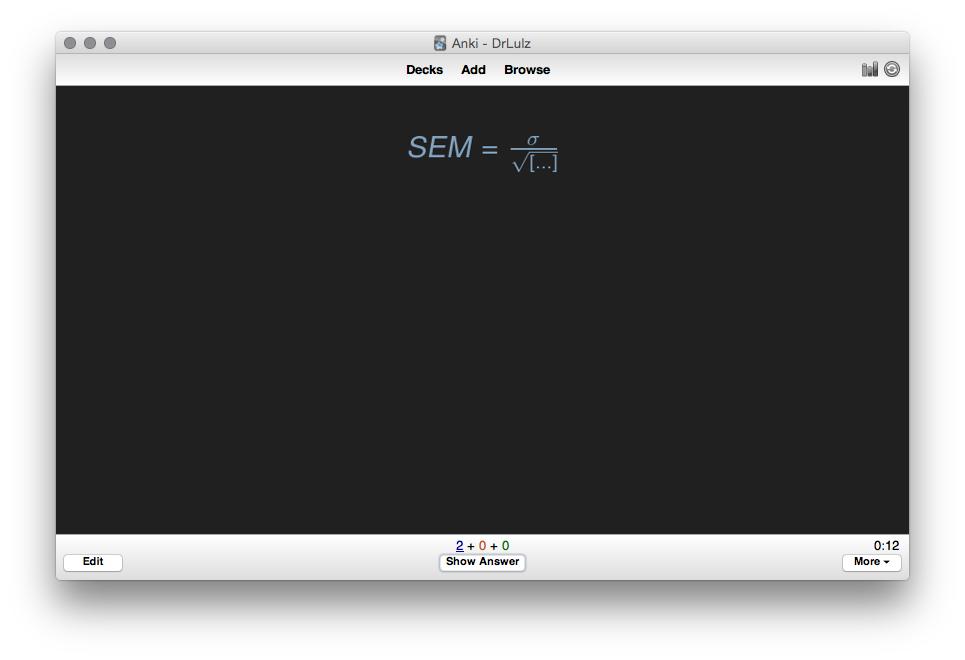
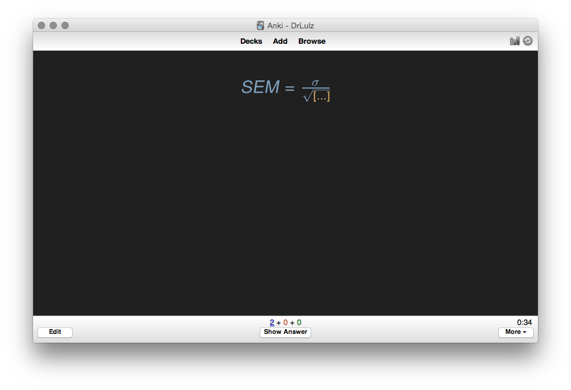
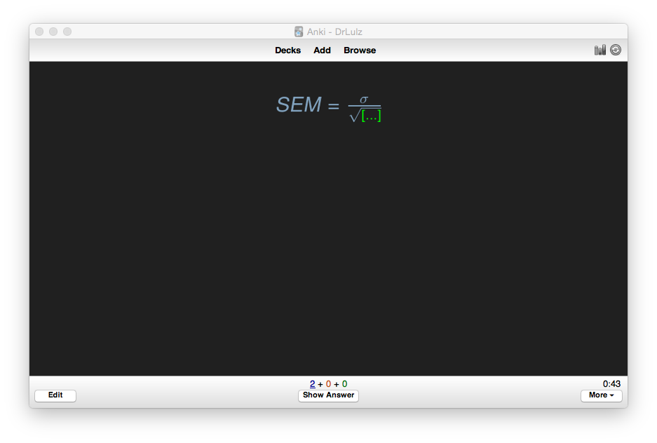

# DrLulz Anki Template

This repository adds extra functionality and styling to Anki cards. 

1. [Magnific Popup](http://dimsemenov.com/plugins/magnific-popup/) for Images
2. Image [Zoom](http://www.jacklmoore.com/zoom/)
3. Notifications via [Noty](http://ned.im/noty/#/about) (For Reinforcement)
4. Dark Styling loosely based on [Tomorrow Night Theme](https://github.com/chriskempson/tomorrow-theme)
5. URL button in cards
6. The jQuery is only available when reviewing on desktop, so the css image styling has been adjusted to show better on mobiles.

##### Notifications & URLs

When creating cards, if the Noty & URL fields are left blank they will not show when reviewing.

 
#### 1. Download the .zip of this repository (right sidebar)
 
#### 2. Locate your Anki user folder

The default location is `/Anki/User 1`  
If you changed your username then `/Anki/DrLulz`  

To ensure you’re in the right place look for directories
- `/Anki/DrLulz/collection.media`
- `/Anki/DrLulz/backups`

 
#### 3. Add jQuery directories and image file

After unzipping move the folders `jquery` & `js`, and the file `man_sm.png` into your user folder.

- `/Anki/DrLulz/jquery`
- `/Anki/DrLulz/js`
- `/Anki/DrLulz/man_sm.png`

 
#### 4. Create / Modify Note Types

You can either create new note types or modify existing types.

- Go to `Tools > Manage Note Types`
- Click `Add` and then select `Add: Basic`
- Assign a unique name to the note type

- In this tutorial we’ll add a basic note type using `basic-single.html`. When finished repeat this process for `basic-double.html` and `cloze.html`

 
#### 5. Add Header / Footer to Note Type

Select your newly created deck, and click the `options` button.

- In the .zip folder locate the file `header-footer.tex`. Optionally, you could just grab the text from the repository.
- Copy `lines 1-11` to the header field, and `line 20` to the footer field.

 
#### 6. Add Fields to Note Type

There are two defaults fields `front` and `back`. To use this template exactly you will need to add eight more fields. You could of course modify this to suit your needs.

##### Add the following fields:

- `Front S/S`
- `Front Image`
- `Back S/S`
- `Back Image`
- `NotyFront`
- `NotyBack`
- `URL`
- `URL Title`

##### Reposition the fields to match the picture.

 
#### 7. Add the HTML

Still in the note types window the Click the `Cards` button. On the left is the `Front Template`, `Styling` and `Back Template`. 

##### From `basic-single.html` 

- Copy `lines 3-50` to the `Front Template` field
- Copy `lines 56-114` to the `Back Template` field

##### From `anki.css`

- Copy everything to the `Styling` field. 

 
#### 8. Create cards & enjoy

### LaTeX Styling

- LaTeX Equations Match the Background
- So the equation `[$]SEM=\frac{\sigma}{\sqrt{{{c1::n}}}}[/$]` would display as:

  
- Optionally, you can color the cloze using HEX color code or naming basic colors:
	- `[$]SEM=\frac{\sigma}{\sqrt{\color[HTML]{E8BF6A}{{c1::n}}}}[/$]`
	
	
	
	- `[$]SEM=\frac{\sigma}{\sqrt{\color{green}{{c1::n}}}}[/$]`
	